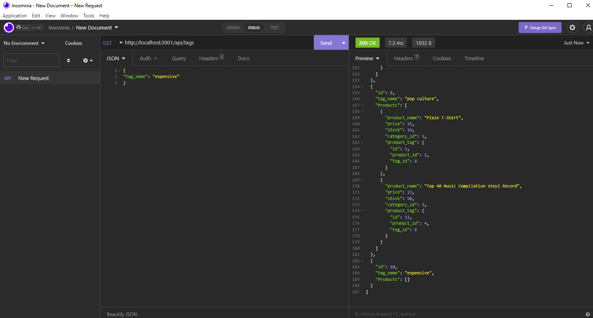

# 13 Object-Relational Mapping (ORM): E-Commerce Back End

## Description
```
Fixing the backend for existing code in javascript, using MySQL and Insomnia
Setting up backend for GET, POST, PUT and DELETE routes to view, create, update and delete data in Insomnia
```

## Acceptance Criteria

```
GIVEN a functional Express.js API
WHEN I add my database name, MySQL username, and MySQL password to an environment variable file
THEN I am able to connect to a database using Sequelize
WHEN I enter schema and seed commands
THEN a development database is created and is seeded with test data
WHEN I enter the command to invoke the application
THEN my server is started and the Sequelize models are synced to the MySQL database
WHEN I open API GET routes in Insomnia for categories, products, or tags
THEN the data for each of these routes is displayed in a formatted JSON
WHEN I test API POST, PUT, and DELETE routes in Insomnia
THEN I am able to successfully create, update, and delete data in my database
```

## Screenshot


## Installation and Usage

```
Run npm i to install dependancies
Enter your credentials in .env file
Run mysql -u root -p and enter password to start mysql
In mysql run SOURCE db/schema.sql to initiate database
Run node seeds/index.js to seed database
Run npm start to start server
```

### Video Link
[Video Link](https://drive.google.com/file/d/1b_WEXPejnf3DZHPEclzBK6HICH987_Rl/view)